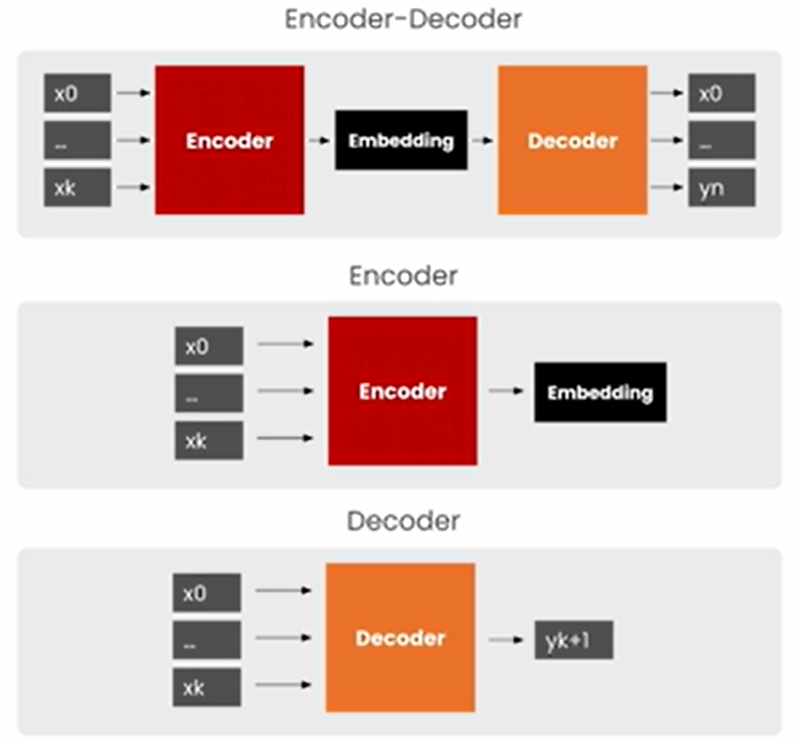
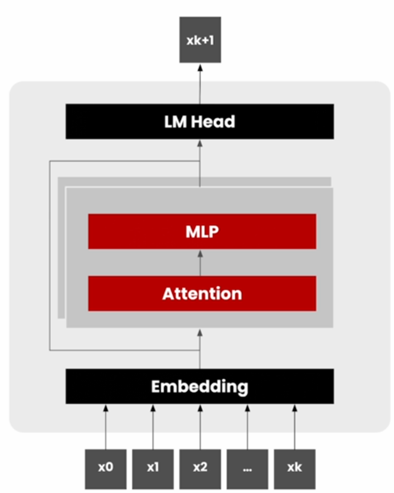
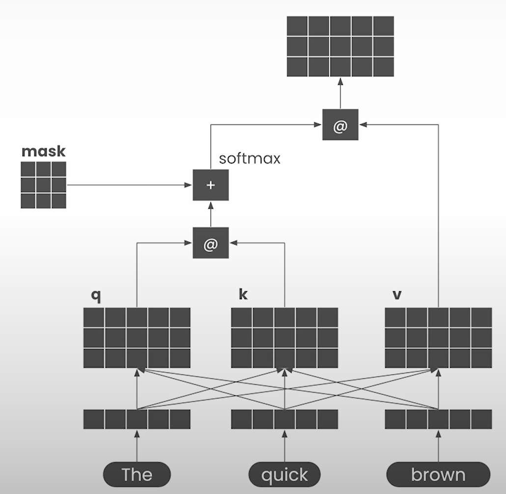
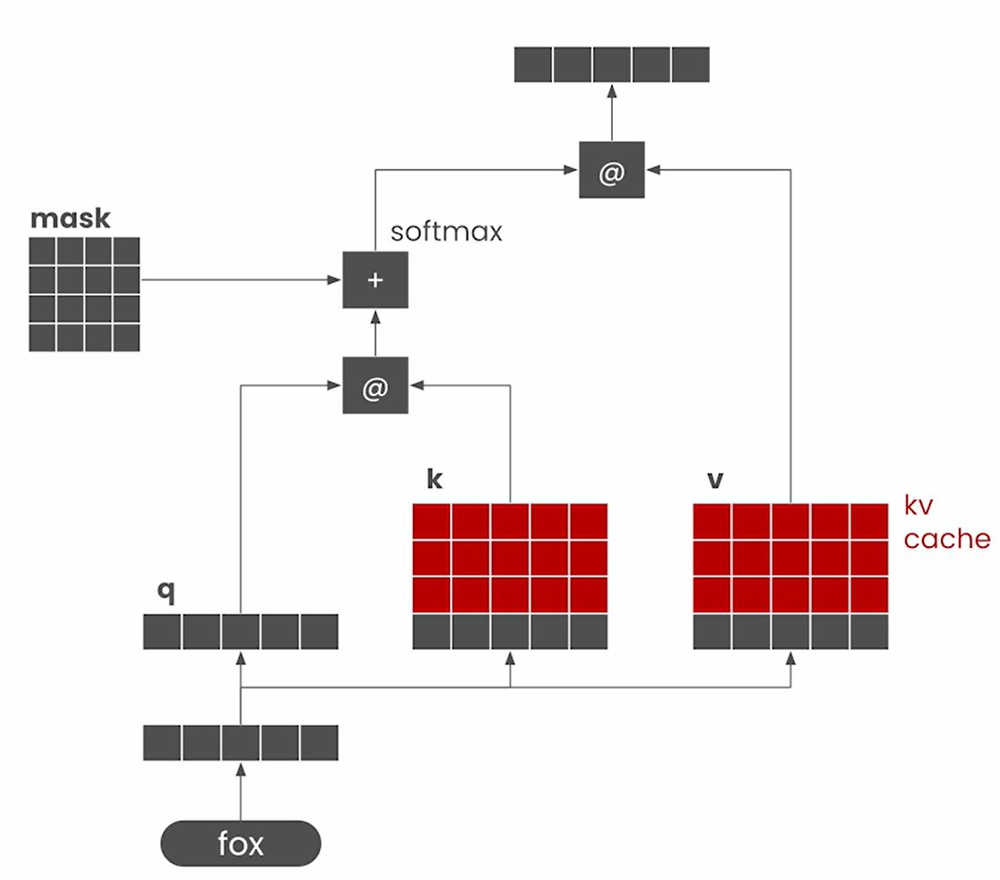

# Text Generation

- Token generation in auto-regressive model can be broken down into two stages:
  - Prefill: Generate the 1st token with all the inputs
  - Decode: Generate the subsequent tokens

- Choice of GPT2
  - Low latency for tasks such as email generation

## Encoder vs Decoder LLMs

- BERT: Encoder only model
  - Useful for creating embedding for usage in tasks such as
    - Classification
    - Similarity Search
  
- GPT: Decoder only model
- Refer the course [Attention in Transformers: Concepts and Code in PyTorch](https://github.com/kaushikacharya/Attention_in_Transformers_Concepts_and_Code/blob/main/notes/Lesson_4.md) to learn Encoder-only, Decoder-only and [Encoder-Decoder models](https://github.com/kaushikacharya/Attention_in_Transformers_Concepts_and_Code/blob/main/notes/Lesson_7.md).

## Autoregressive Language Models

- Generates one token at a time

## KV Cache - Prefill

- Biggest computational block: Attention computations

- Matrix size is proportional to the input sequence
  - In the figure example, it is 3 tokens from the sequence "The quick brown"
- Refer the course [Attention in Transformers: Concepts and Code in PyTorch](https://github.com/kaushikacharya/Attention_in_Transformers_Concepts_and_Code/blob/main/notes/Lesson_2.md) to learn self-attention computation.

## KV Cache - Decode

- The need for previous tokens are only required for attention computation.
  - We need the $k$ and $v$ values for the previous tokens.
  - These can be cached and concatenated to the corresponding values for the new token.
- KV caching enables skipping of attention computation over the tokens again and again

## Other Techniques

- PagedAttention
  - Not covered in this course

## Notebook

- [Jupyter Notebook](../code/Lesson_1-Text_Generation.ipynb)
- Issues faced in local run:
  - "*A module that was compiled using NumPy 1.x cannot be run in NumPy 2.2.4 as it may crash*"
  - Solution:
    - Downgraded numpy < 2.0 as suggested in [StackOverFlow thread](https://stackoverflow.com/questions/78636947/a-module-that-was-compiled-using-numpy-1-x-cannot-be-run-in-numpy-2-0-0-as-it-ma)
    - Added numpy version in [requirements.txt](../code/requirements.txt)
- logits shape
  - <batch size, sequence length, vocabulary size>
- Other decoding strategies like Multinomial sampling can choose token other than the one with the highest probability
  - This leads to creativity in text generation
  - Multinomial sampling randomly selects a token based on the probability distribution over the entire model's vocabulary. [Source: Generation strategies by HuggingFace](https://huggingface.co/docs/transformers/main/en/generation_strategies#multinomial-sampling)
- Generated next token is concatenated to previously generated tokens for next input to the model.

### Additional Info

- [Article](https://github.com/christianversloot/machine-learning-articles/blob/main/easy-causal-language-modeling-with-machine-learning-and-huggingface-transformers.md) by Christian Versloot
  - GPT-2 is open-source whereas GPT-3 is closed source
  - Describes Causal Language Modeling (We import `AutoModelForCausalLM` from `transformers` library to load GPT2 model)
  - Uses `top_k_top_p_filtering` from `transformers` to fetch top K logits
