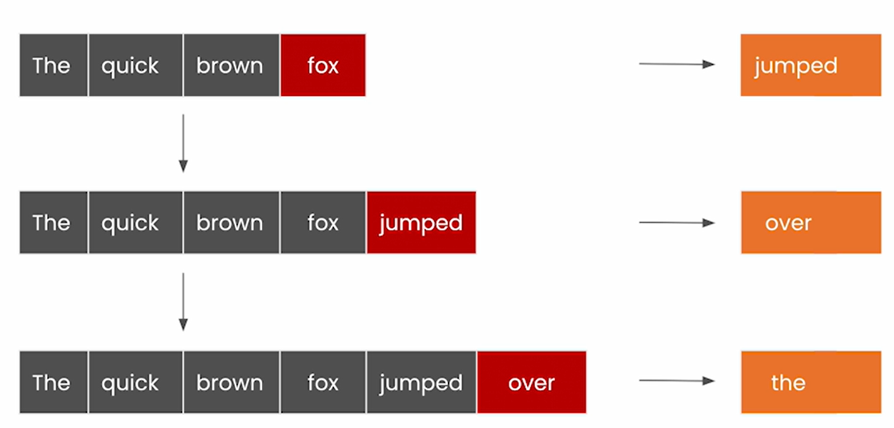
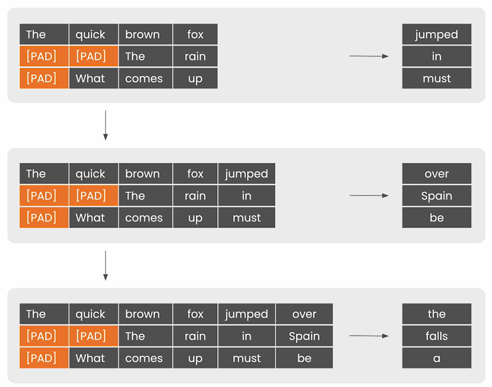
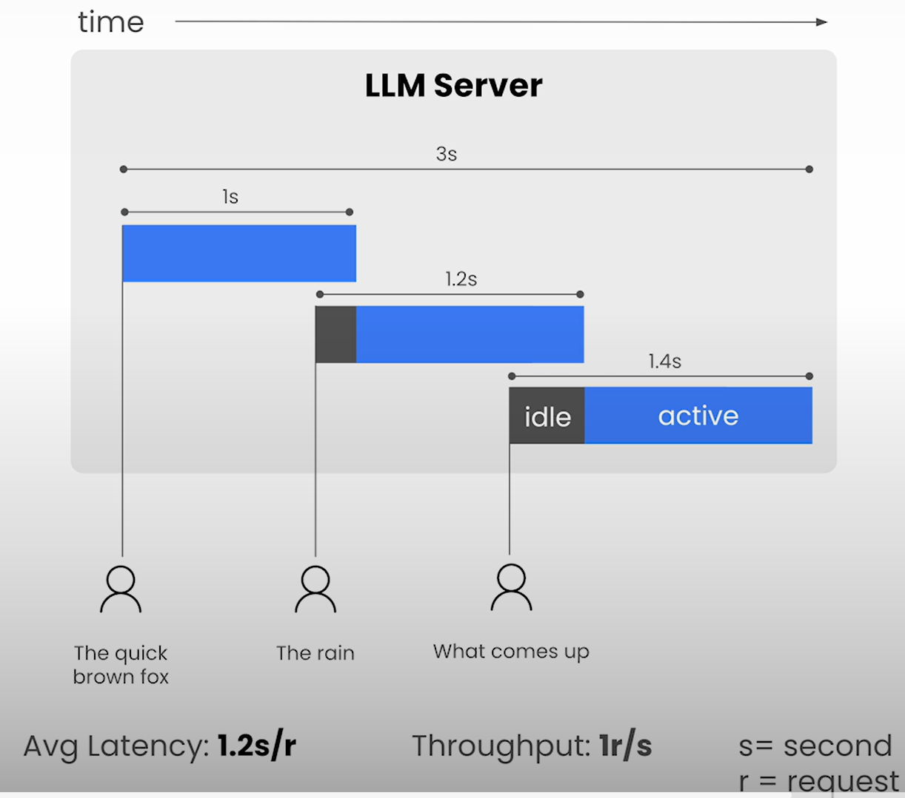
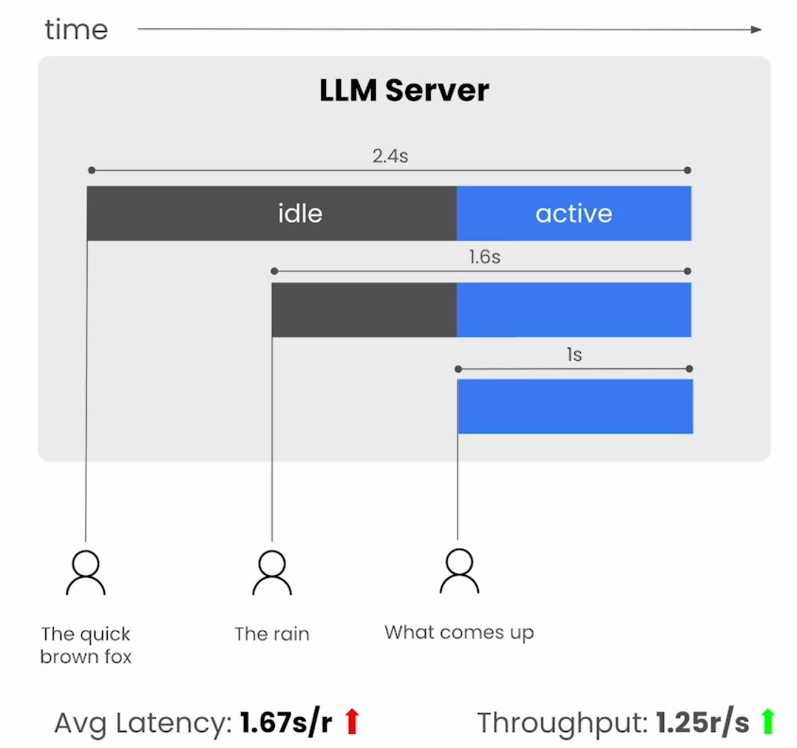

# Batching

## Objective

- Multiple request
- Trade-off between **throughput** (handling multiple request) and **latency** (responding to any one request)

## Single Request Generation

## Multi Request Generation

- Padding tokens ensure consistent matrix shape.

## Throughput vs Latency

- Additional Info (KA)
  - Definitions:
    - **Latency**: The overall time it takes for the model to generate the full response for a user.
    - **Throughput**: The number of output tokens per second an inference server can generate across all users and requests.
      - In [Lesson 7 notebook](./Lesson_7.md#notebook) (cell using `client.generate_stream`):
        - Throughput is computed as the number of tokens generated per second for subsequent tokens (i.e. 2nd token onwards).
        - First generated token's latency is termed as Time to First Token (TTFT)
  - Source: [Databricks article: LLM Inference Performance Engineering: Best Practices](https://www.databricks.com/blog/llm-inference-performance-engineering-best-practices)

- Optimized for latency
  - Minimize wait time for individual requests
  
  - My understanding (KA):
    - Latency = $1 + 1.2 + 1.4$ = $3.6$ seconds
      - Average Latency: $3.6/3$ = $1.2$ seconds/request
    - Throughput:
      - 3 seconds overall for 3 requests
      - Hence throughput = 3/3 = 1 requests/second

- Prioritize throughput over latency (Batching)
  - We wait for requests to create batch
  
  - My understanding (KA):
    - Latency = $2.4 + 1.6 + 1$ = $5$ seconds
      - Average Latency: $5/3$ = $1.67$ seconds/request
    - Throughput:
      - $2.4$ seconds overall for 3 requests
      - Hence thoughput = $3/2.4$ = $1.25$ requests/second

- We'll study the effect of batch size on throughput vs latency
  - In the notebook batch size are varied in terms of power of 2.

- Objective:
  - Increase throughput with trade-off in latency.

## Notebook

- [Jupyter Notebook](../code/Lesson_2-Batching.ipynb)
- Padding and Truncation details available on [Hugging Face](https://huggingface.co/docs/transformers/v4.35.2/en/pad_truncation)
- Observation: Padded tokens are not assigned attention
- ?? position_ids are assigned 1 for padded tokens
  - What purpose does it serves?
- ?? Unlike the computation shown [above](#throughput-vs-latency), there's no consideration of "idle" time for latency computation.
- `attention_mask` shape:
  - [GPT2Model.forward documentation](https://huggingface.co/docs/transformers/v4.35.2/en/model_doc/gpt2#transformers.GPT2Model.forward) mentions:  
    > If `past_key_values` is used, attention_mask needs to contain the masking strategy that was used for `past_key_values`. In other words, the attention_mask always has to have the length: len(`past_key_values`) + len(`input_ids`)
    - This describes the reason for using `torch.cat` to update `attention_mask` in `next_inputs`.
- `position_ids` shape:
  - [GPT2Model.forward documentation: transformers v4.35.2](https://huggingface.co/docs/transformers/v4.35.2/en/model_doc/gpt2#transformers.GPT2Model.forward.position_ids) mentions  
    `position_ids` of shape `(batch_size, sequence_length)`.
    - ?? But in the notebook, we are passing with shape `(batch_size, 1)`.
  - **Update**:  
    - [April 23, 2025 github issue](https://github.com/huggingface/transformers/issues/37702) points out:
      > `input_ids` and `position_ids` should have the same shape
    - Basis that [pull request #37729](https://github.com/huggingface/transformers/pull/37729) changes the following in the documentation
      > `position_ids` shape: (`batch_size`, `input_ids_length`)
      - This change is reflected in the [current version documentation](https://huggingface.co/docs/transformers/main/en/model_doc/gpt2#transformers.GPT2Model.forward.position_ids)

  - Documentation also mentions
      > If `past_key_values` is used, only input_ids that do not have their past calculated should be passed as `input_ids`.
      >
      > The `input_ids` which have their past given to this model should not be passed as `input_ids` as they have already been computed.

    - Following these instructions, in the Jupyter Notebook, `input_ids` passed for the next tokens of the batch as `past_key_values` is used.

  - IMHO the definition of `input_ids_length` is incorrect when `past_key_values` is present:
  
    > `input_ids_length` = `sequence_length` if `past_key_values` is None else `past_key_values[0][0].shape[-2]` (sequence_length of input past key value states)
    - This is being discussed in the [above github issue thread](https://github.com/huggingface/transformers/issues/37702).
