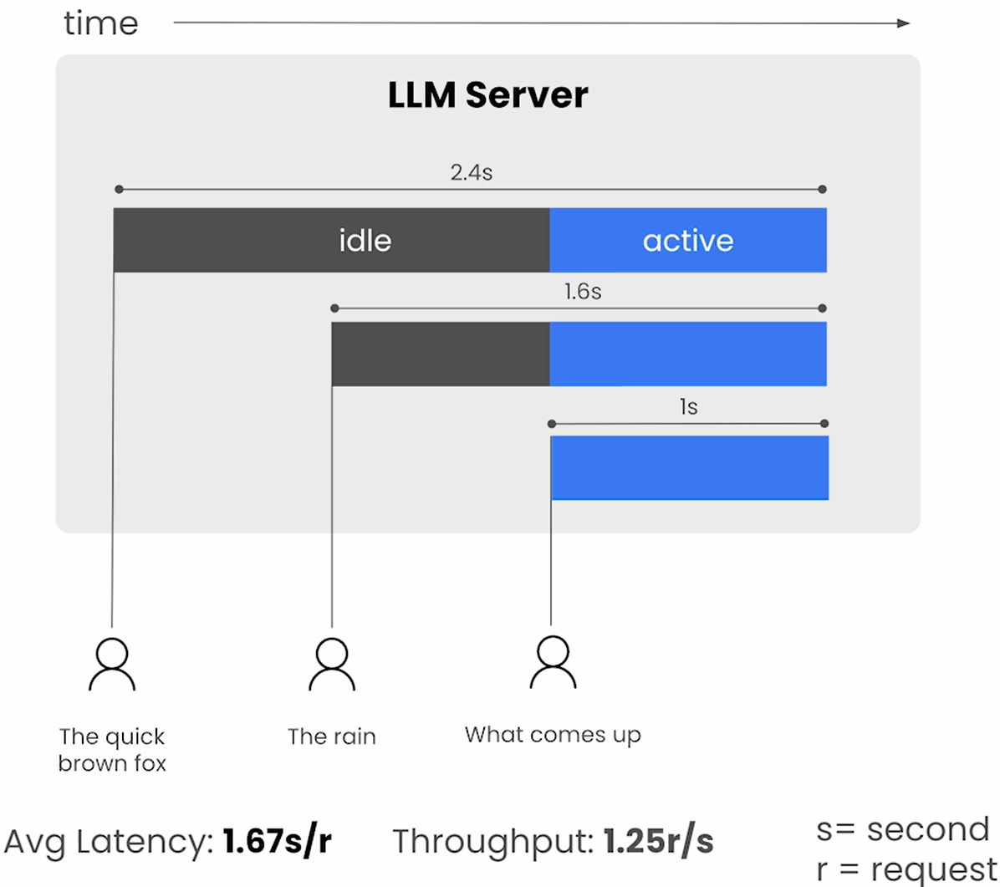
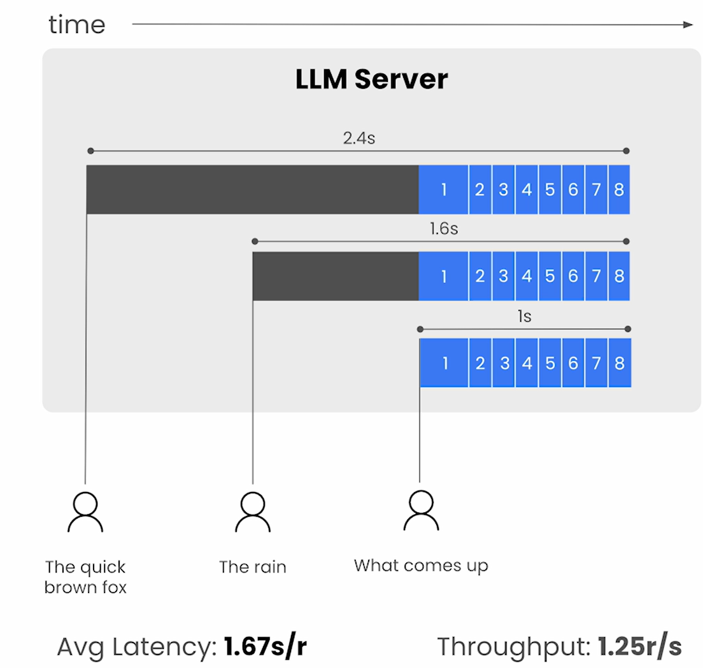
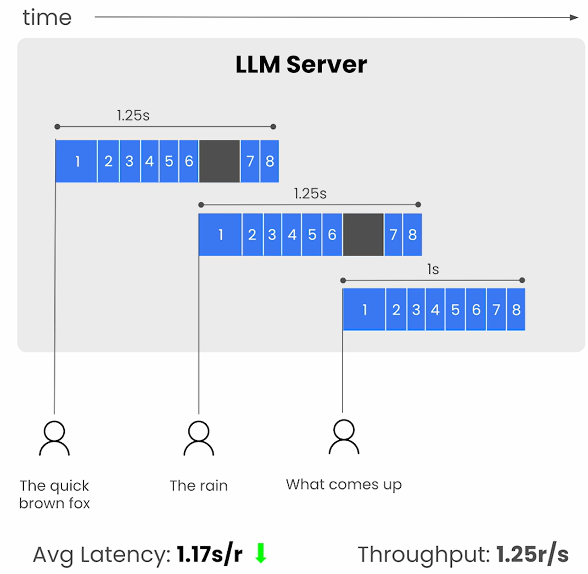
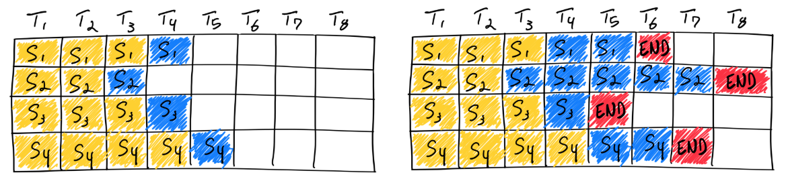
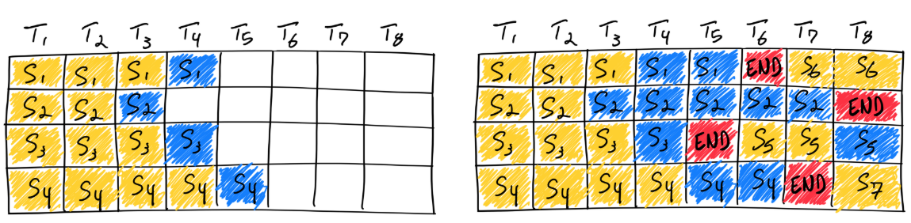
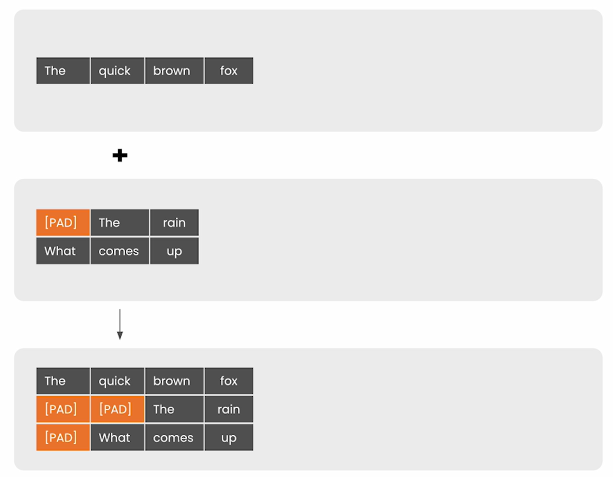
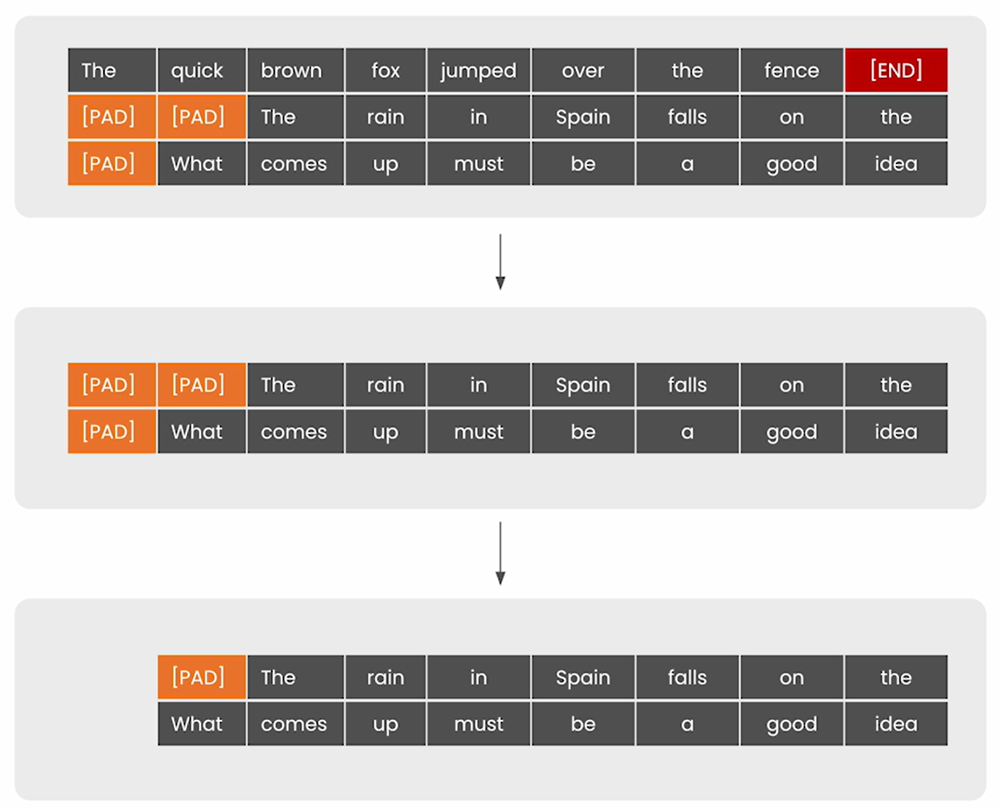

# Continuous Batching

- This gets the best of both worlds:
  - High Throughput
  - Low Latency

## Synchronous Batching

- All these token generation can be treated independently.
- This is possible since the models are auto-regressive i.e. generate one token at a time.

## Continuous Batching Technique

- Greedily process tokens as they come
- Heart of Continuous Batching:
  - Constantly moving elements in and out of the batch even though some elements may stick around for some amount of time.

## Additional Info (Anyscale)

- [Anyscale article](https://www.anyscale.com/blog/continuous-batching-llm-inference)
- Important points related to LLM inference
  - Initial ingestion (aka prefill)
  - LLM inference is memory-IO bound and not compute bound
  - GPU memory consumed scales with base model size + length of the token sequence
- Batching prevents loading of new model parameters for every new input sequence
- Naive/Static Batching
  
  - This illustration shows the underutilization of GPUs
    - The size of the batch remains constant until the inference is complete.
  - Large context length of LLMs could cause massive underutilization of GPUs due to variance in generation
- Continuous Batching
  - Iteration-level scheduling: Batch size is determined per iteration
  - $T_1$, $T_2$ etc. are the iterations in the above and below illustrations.
  - Result: Once a sequence in a batch has completed generation, a new sequence can be inserted in its place
  

### Merging Batches

- Serves the following two purposes
  - Add padding tokens wherever necessary
  - Concatenating two tensors

### Filtering Batches

- Serves the following two purposes
  - Remove the sequences which have either reached END token or reached max number of tokens
  - Remove additional padding

## Notebook

- [Jupyter Notebook](../code/Lesson_3-Continuous_Batching.ipynb)
- Request queues where a few sequences generated are much longer than the rest of the sequences.
- `cached_batch`: The cached batch that can be used for subsequent decode steps.
  - These needs to be then removed from the request queue.
- Run in while loop till at least one of the condition is True
  - request queue is still non-empty
  - There are sequences that is still under processing
- Padding
  - My understanding based on [torch.nn.functional.pad](https://pytorch.org/docs/stable/generated/torch.nn.functional.pad.html) documentation:
    - `attention_mask` shape (`batch_size`, `sequence_length`) (source: [transformers documentation](https://huggingface.co/docs/transformers/v4.35.2/en/model_doc/gpt2#transformers.GPT2Model.forward.attention_mask))
      - As we need to pad only the last dimension, pad has the form (`padding_left`,`padding_right`)
    - `past_key_values`
      - key and value shape (`batch_size`, `num_heads`, `sequence_length`, `embed_size_per_head`) (source: [transformers documentation](https://huggingface.co/docs/transformers/v4.35.2/en/model_doc/gpt2#transformers.GPT2Model.forward))
        - As we need to pad only last but one dimension, pad has the form `(padding_left,padding_right, padding_top,padding_bottom)`
  - Implemented in [merge_batches() of helpers.py](../code/helpers.py)
