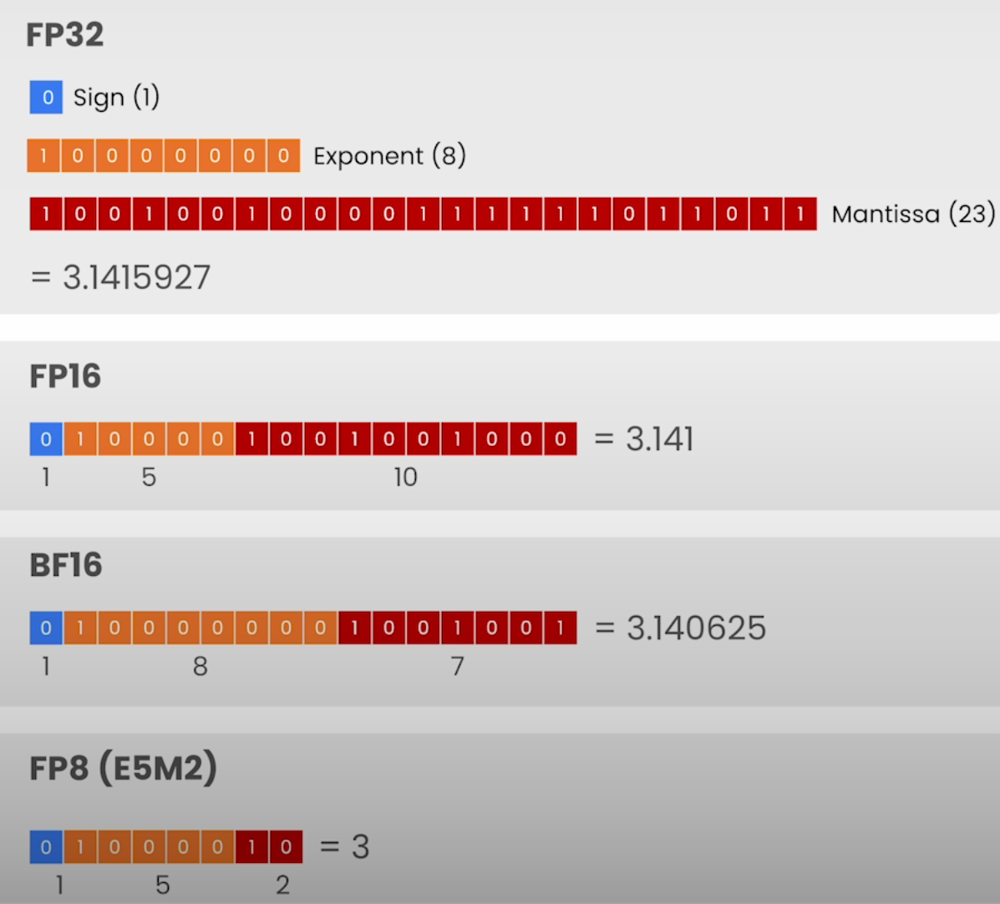
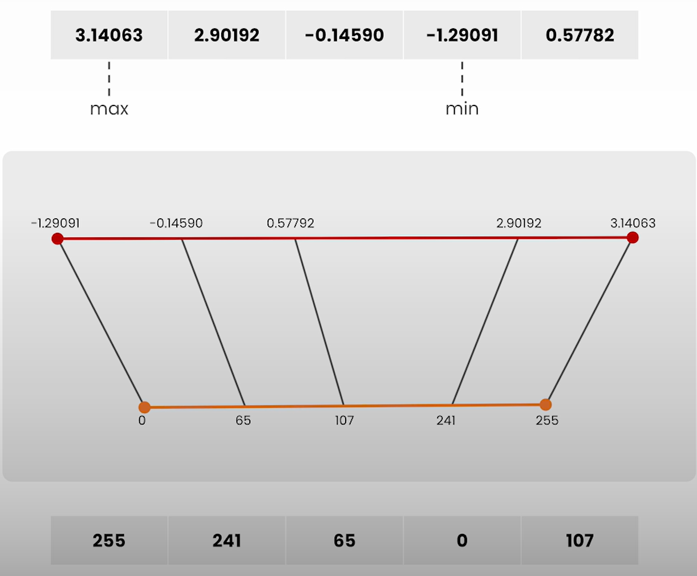
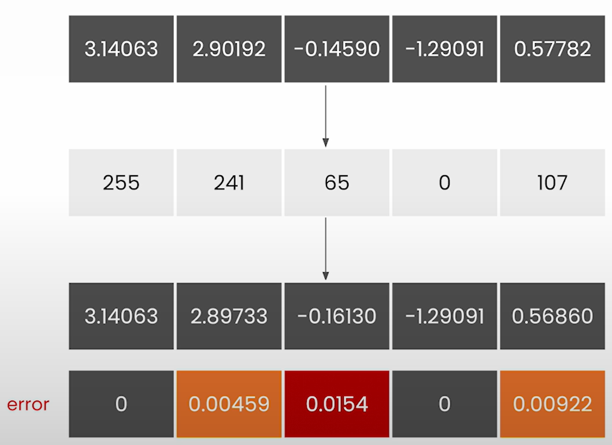

# Quantization

## Lesson Objective

- Implement quantization algorithm to quantize 8 bits per parameter
- Dequantize just-in-time during inference

## Floating Point Representations

- 3 components
  - Sign (single bit)
  - Exponent (Represent magnitude)
  - Mantissa (Primarily represent the decimal part)
    - Also called Significant
    - Defines precision

- FP16
  - Standard Float 16 bit
- BF16
  - Larger range of magnitude
  - $\pi$ value shows that precision is lower compared to FP16
- FP8
  - Floating point in 8 bit

- Detailed explanation available in the course: [Quantization Fundamentals with Hugging Face (Lesson #2)](https://github.com/kaushikacharya/Quantization_Fundamentals/blob/main/notes/Lesson_2.md#floating-point)

## Zero-Point Quantization

- Concept and Mathematics behind Linear Quantization is explained in the course: [Quantization Fundamentals with Hugging Face (Lesson #4)](https://github.com/kaushikacharya/Quantization_Fundamentals/blob/main/notes/Lesson_4.md)

## Quantization Error

- The example shows integer quantization of float values (top layer). Error (difference) between the dequantized values and the original float values.

## Notebook

- [Jupyter Notebook](../code/Lesson_4-Quantization.ipynb)
- `requires_grad` set as False since int8 datatype is non differentiable.
- In production, dequantization of layers are done just in time.
- Suggestion for experimentation
  - Instead of computing **states** for the entire parameters, we can compute per row or per column on the parameters.
- Observation of generated response of dequantize model
  - 1st prompt's generated content is quite different from the one generated by original model.
  - 2nd and 3rd prompt generates gibberish content.
