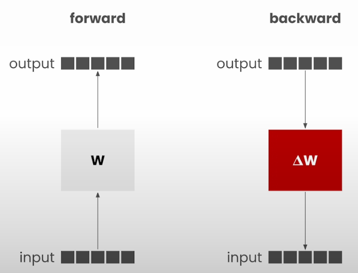
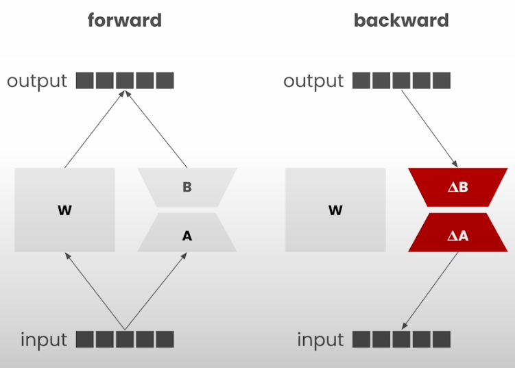

# Low-Rank Adaptation

- Low-Rank adaptation: Parameter Efficient Fine-Tuning technique to customize LLMs without changing the existing model parameters.

## Fine-Tuning

- Goal: Adjust the weights of the model to better suit specific task or specific dataset.

- In normal fine-tuning, every parameters is modified during the backward pass.

## Low-Rank Adaptation (LoRA)

- LoRA considers certain set of parameters somewhere around the layers surrounding the attention
- In some cases, all the layers of the model are considered
- In addition to original weights, additional weights are introduced (termed as A, B in the above image)
- Adapter Weights shape
  - Input shape of A = Input shape of W
  - Output shape of B = Output shape of W
  - Internal shapes (Output shape of A and Input shape of B) are very low (around 1 % of original weights size)
    - Termed as rank
- Hot swapping LoRA adapters
  - Focus of this and the next lesson

## Notebook

- [Jupyter Notebook](../code/Lesson_5-Low-Rank_Adaptation.ipynb)
- Unlike previous assignments, toy model is used.
- KA: Additional resources
  - [Matrix multiplication with PyTorch](https://www.geeksforgeeks.org/python-matrix-multiplication-using-pytorch/)
