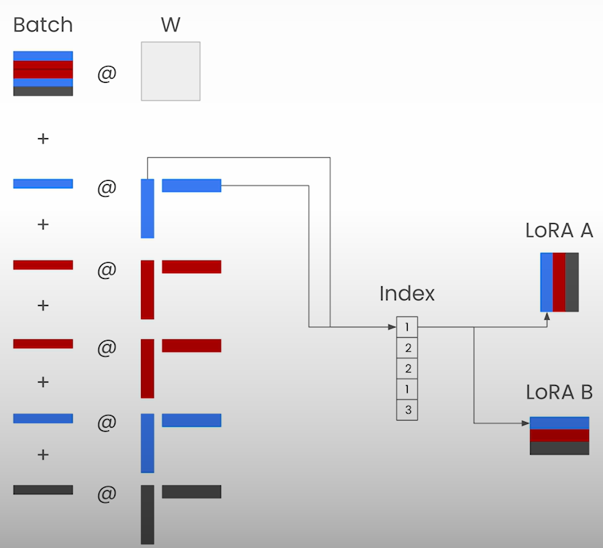
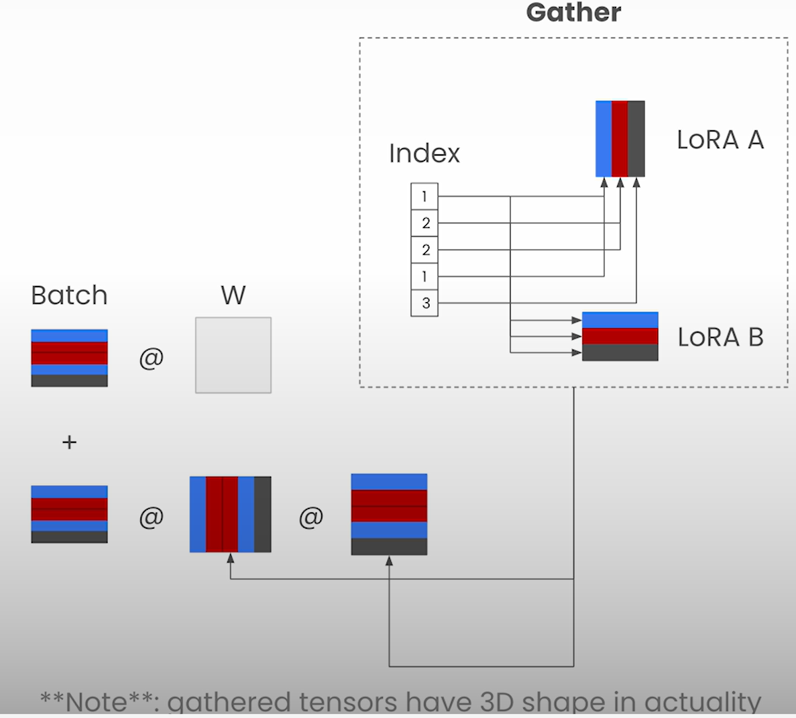
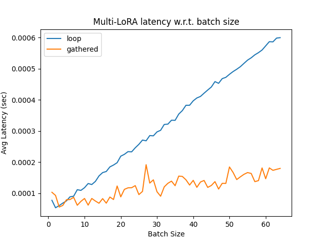

# Multi-LoRA Inference

## Lesson Objective

- Combine LoRA and Continuous Batching to create end-to-end system that scales to many fine-tuned models with same base model.

## Example Use Cases for Multiple LoRAs

- Training on Different Segments of Data
  - Example: Code completion assistants trained on different portions of a code repository
- Chaining several Related Tasks
  - Training different tasks in a workflow
  - Example: Agent based customer support system
- Supporting Multiple Tenants
  - Example: Enabling many enterprise users to fine-tune and serve adapters on one base model

### Challenge

- In all these use cases, we need to serve many fine-tuned models sharing the same base model. And these need to be served concurrently.
- Naive Approach:
  - Separate deployment of fine-tuned models which would be expensive, or
  - A slow system that process a single adapter at a time and constantly swap them in and out of memory.
- In this lesson, we will see how to deploy dozens of fine-tuned models in a single depolyment without sacrificing on throughput.

## Loop Implementation

- `LoopMultiLoraModel` implementation in the notebook

## Gathered Implementation

- Vectorized computation implementation

## Additional Optimization Steps

- Support LoRA adapters of different ranks
  - Though in the notebook we used adapters of same rank
- Support mixed batches of requests with/without LoRA adapters
- Improve efficiency of index select step
- Organize by "segments" of same requested LoRA adapter to reduce copies in memory
  - Instead of using different adapters for each element in the batch, "segment" elements in batch
- Implement as CUDA kernel rather than in PyTorch for improved performance
  - CUDA kernel fuses gather and LoRA computation together

## Notebook

- [Jupyter Notebook](../code/Lesson_6-Multi-LoRA.ipynb)
- Average latency w.r.t. batch size compared for two different implementations:
  - `LoopMultiLoraModel`
    - We loop over each row in the batch.
      - `batch_idx` represents index of the current row that is being processed.
      - KA: IMHO `batch_idx` is a misnomer.
    - ?? What is the advantage of converting `lora_indices` to numpy?
      - This changes `lora_idx` from tensor to int.
      - But not clear to me what's the advantage it provides as the matrix multiplication takes over tensors.
  - `GatheredMultiLoraModel`
    - LoRA weights for each batch gathered using `torch.index_select`

- Average latency plot shows benefit of vectorization over looping in CPU itself:
  
- For CPU implementation, embedding and LoRA rank dimensions were kept low.
