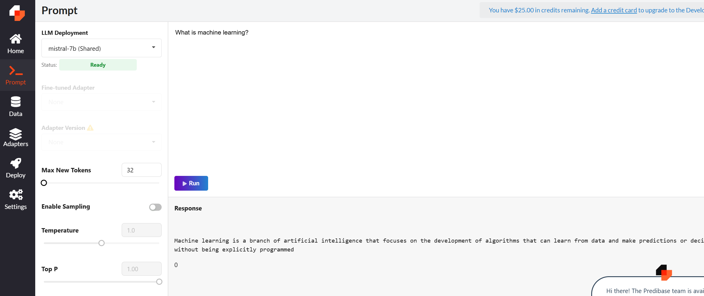
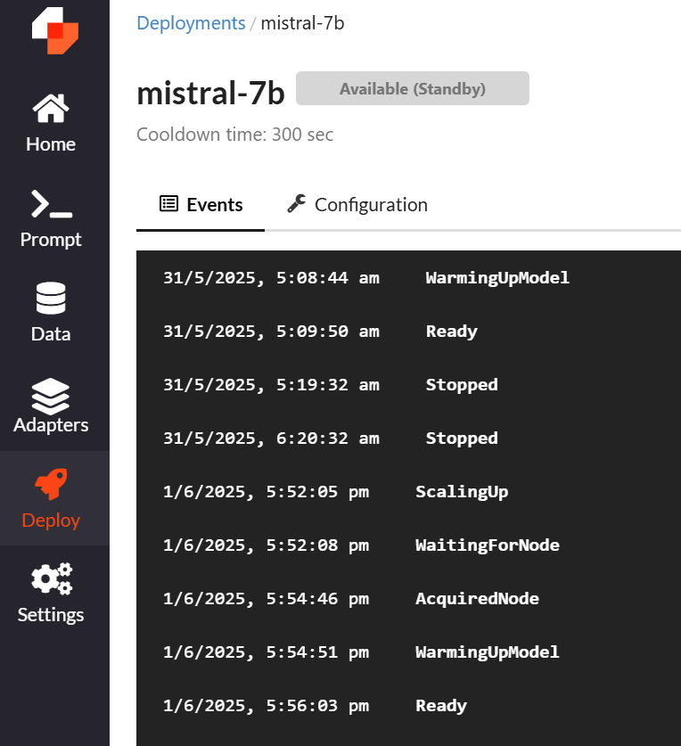

# LoRAX

- The course covered the foundational elements of a modern LLM inference stack
  - Prefill vs decode: KV caching ([Lesson #1](./Lesson_1.md))
  - Continuous Batching (Lesson [#2](./Lesson_2.md), [#3](./Lesson_3.md))
  - Quantization ([Lesson #4](./Lesson_4.md))
  - Multi-LoRA: Fine-tuned model inference (Lesson [#5](./Lesson_5.md), [#6](./Lesson_6.md))

## Objective

- Show working of previous lessons in LoRAX

## Predibase Open-source Projects

- [LoRAX](https://github.com/predibase/lorax)
- [Ludwig](https://github.com/ludwig-ai/ludwig)

## Notebook

- [Jupuyter Notebook](../code/Lesson_7-LoRAX.ipynb)
- Pre-requisite
  - Created [free trial credit account](https://docs.predibase.com/user-guide/getting-started/usage-billing) to execute this notebook locally by connecting to Predibase managed LoRAX shared endpoints.
  - Creation of LoRAX client explained in [Predibase docs' Python Client](https://loraexchange.ai/reference/python_client/#predibase-inference-endpoints)
    - You would need to set the following in [.env](../code/.env)
      - Predibase API token
      - Predibase Tenant ID
    - *Alternative approach*: [Predibase docs' Python SDK](https://docs.predibase.com/inference/querying#python-sdk)
      - **Warning**: This would require installing `predibase` library which would update version of libraries listed in [requirements.txt](../code/requirements.txt)
- Issues faced and solutions applied:
  - Issue #1:
    - `ReadTimeout: HTTPSConnectionPool(host='serving.app.predibase.com', port=443): Read timed out`
    - **Reason**: Default [Client](https://github.com/predibase/lorax/blob/b5a9e38dc9479ca664bbaac9ae949e27e3c30832/clients/python/lorax/client.py#L67) timeout = 60 seconds, whereas it takes few minutes for a standby model to be ready on the Predibase server.
    - Execute a prompt
      
      - This would spin-on the server for the chosen model in a few minutes.
        - Wait for the model's status to change from `Available (Standby)` to `Ready`
      - You can see the change of status in the deployment logs
        
      - Once the model's status turns `Ready`, you can execute the Jupyter notebook.
  
  - Issue #2: HuggingFace error on usage of adapter

    > GenerationError: Request failed during generation: Server error: 401 Client Error.
    >
    > Repository Not Found for url: https://huggingface.co/api/models/predibase/conllpp.
    >
    > Please make sure you specified the correct `repo_id` and `repo_type`.
    > If you are trying to access a private or gated repo, make sure you are authenticated.
    > Invalid credentials in Authorization header

    - Inside the function `run_with_adapter`, call to `client.generate_stream` requires `api_token` parameter with **HuggingFace token**.
    - Additional Info:
      - In lorax's github an user has created a [pull request](https://github.com/predibase/lorax/issues/541) to utilize environment variable in case `api_token` isn't provided in the function call.
        - This provided me the idea to pass api_token value as HuggingFace token.

- Endpoint URL mentioned in [Predibase docs for Serverless Shared Deployments](https://docs.predibase.com/inference/deployments/shared#with-rest-api)
- `client.generate`
  - synchronous function
    - Doesn't stream the tokens one by one
    - Returns the entire response as a single return
- `client.generate_stream`
  - Here we'll learn how prefill and decode works in modern LLM inference system
  - First token takes more time than subsequent tokens (which is referred as decode)
    - Since for subsequent tokens attention matrices (Key, Value) are cached for most of the tokens utilized in its computation which was missing for the first token generated
  - Every response of this function is a single token
  - TTFT: Time to First Token
    - Also called latency of the first token
- `AsyncClient`
  - Text generated in different colors represent text generation execution of the different requests which are being processed concurrently (inferred from the printing of the output)
- Execution of 3 different tasks (sentence completion, summarization and Named Entity Recognition (NER)) executed with 3 different adapters on the same base model (Mistral 7B)
- Structured Generation
  - Enforces output defined as per schema created using `pydantic`
